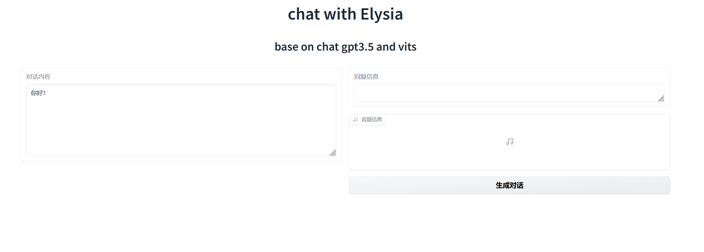

# Chat with Elysia

### 基于chatgpt与vits

- 项目默认的ChatGPT引擎为gpt-3.5-turbo，如果有chatgpt4.0，可以在config.json中将其替换
- vits模型下载链接在/model路径下，该模型来自于b站up主“Saya睡大觉中”，如有侵权请联系我删除。下载完成后将模型和配置文件放到/model路径下即可，如需替换模型请自行对项目进行修改

### 关于项目配置

- 请在项目根目录下config.json中设置openai的账户key，同时设置vpn代理以确保可以连接到openai
- 项目默认的python版本为python3.9，由于git限制，项目中仅包括部分依赖，可以尝试使用命令

```shel
python main.py
```

​	查看缺少的依赖，使用命令

```shel
pip install <name>
```

​	进行依赖安装，注意利用pip安装依赖时如果开启代理可能出现错误，使用代理的命令如下：

```shel
pip install <name> --proxy=127.0.0.1:port
```

- 如果存在安装module后冲突错误等问题，请使用项目目录下的python3.9.6 installer安装3.9.6版本

### 正确启动项目之后

- 在所有的依赖都正确安装完成之后，使用命令：

```shell
python main.py
```

​	启动项目，一段时间后浏览器应该会弹出项目网页，如若未主动弹出，请浏览器中自行访问**http://127.0.0.1:7860**

- 正确运行后项目界面应如下图所示
- 

- 单次对话内容将存储在data目录下开始对话时间为名字的文件夹下，其中包括文字内容以及生成的音频